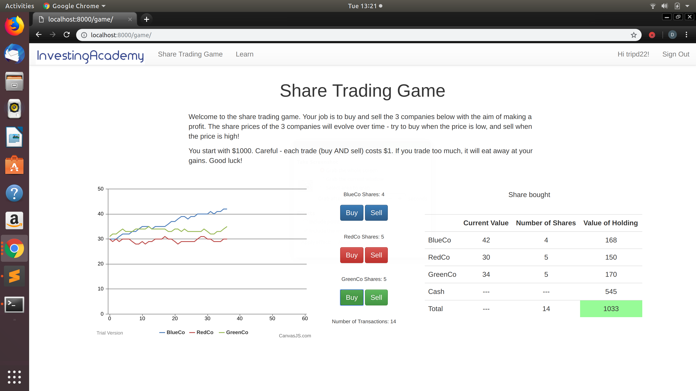

# share-trading-game
This is a basic Django web application designed to teach financial and investing concepts to students through gamification. By introducting investing concepts gradually and giving students the chance to play with these concepts, this application seeks to increase student engagement and hopefully result in better learning outcomes.

